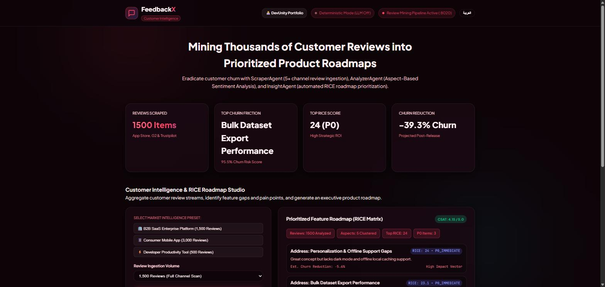
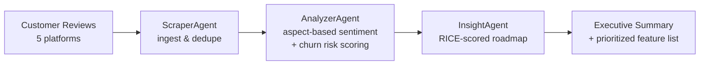

# 💬 FeedbackX

**Turns thousands of scattered customer reviews into a churn-risk-ranked, engineering-ready product roadmap — automatically.**

[](LICENSE)
[](https://www.python.org/)
[](feedbackx/server.py)
[-orange.svg)](https://ollama.com)
[](https://asadullahshafique-devunity.vercel.app)



---

## The problem

Product teams drown in feedback long before they run out of ideas. Thousands of App Store, Play Store, G2, Trustpilot, and Reddit reviews pile up, and the handful of comments that actually predict churn get buried under noise. Manually triaging that volume into a defensible "build this next" list doesn't scale.

## What FeedbackX does

FeedbackX runs a small pipeline of purpose-built agents that turn raw review text into a prioritized, numbers-backed roadmap:



1. **`ScraperAgent`** ingests customer reviews from multiple platforms (App Store, Google Play, G2, Trustpilot, Reddit). The bundled demo uses a deterministic, reproducible review generator rather than live scraping — see [Design notes](#design-notes) for why.
2. **`AnalyzerAgent`** performs real Aspect-Based Sentiment Analysis: it clusters reviews into product aspects by keyword, then scores each cluster's sentiment and churn risk from a blend of star rating and a lightweight sentiment lexicon — not fixed numbers.
3. **`InsightAgent`** scores every aspect with an actual **RICE formula** (Reach × Impact × Confidence ÷ Effort), sorts the roadmap by that score, and estimates churn reduction per shipped item.
4. **`FeedbackXEngine`** synthesizes an executive summary from the computed metrics, optionally enriched by a free, locally-run LLM (see below) — and always falls back to a deterministic, template-built summary if that LLM isn't available.

The result changes with the input: feed it a different review count or mix, and the aspect clusters, RICE scores, and roadmap ordering move with it — nothing here is hardcoded demo output.

## Free-tier LLM enrichment (Ollama)

The executive summary can optionally be enriched by [Ollama](https://ollama.com), running a small open model (`llama3.2` by default) **entirely on your own machine** — no API key, no account, no per-token billing.

- **Off by default.** With `FEEDBACKX_ENABLE_LLM` unset, FeedbackX runs its deterministic summary path and never attempts a network call.
- **Fails soft.** If Ollama isn't running, isn't reachable, or times out, `OllamaProvider` returns `None` and the deterministic summary is used instead — the API never errors because of it. See `feedbackx/core/llm_provider.py` and `tests/test_llm_provider.py`.
- **Transparent in the UI.** The dashboard's header pill calls `GET /api/v1/system/llm-status` and shows whether enrichment is active, off, or configured-but-unreachable.

## 🚀 Run the live demo

The whole stack — API, dashboard, and a real local LLM — runs from one command, no cloud account or API key required.

```bash
git clone https://github.com/asadullah48/feedbackx.git
cd feedbackx
docker compose up --build
```

Then open **http://localhost:8020**. The first run pulls the `llama3.2` model in the background (a few minutes, once) via the `ollama-pull` service; the dashboard works immediately in the meantime and simply falls back to deterministic summaries until the model is ready.

<details>
<summary>Run without Docker (deterministic mode only)</summary>

```bash
python -m venv .venv && .venv/Scripts/activate   # or: source .venv/bin/activate
pip install -e ".[dev]"
uvicorn feedbackx.server:app --host 0.0.0.0 --port 8020
```

To enable LLM enrichment this way too, install [Ollama](https://ollama.com) locally, run `ollama pull llama3.2`, copy `.env.example` to `.env`, and set `FEEDBACKX_ENABLE_LLM=true`.
</details>

### Key endpoints

| Method | Path | Description |
|---|---|---|
| `GET` | `/` | Bilingual (English / Arabic RTL) dashboard |
| `POST` | `/api/v1/feedback/generate-intelligence?review_count=1500` | Run the full pipeline, return a `MarketIntelligenceReport` |
| `GET` | `/api/v1/feedback/sample-reviews?count=10` | Raw sample reviews, unanalyzed |
| `GET` | `/api/v1/system/llm-status` | Whether Ollama enrichment is enabled/reachable |
| `GET` | `/healthz`, `/readyz` | Liveness / readiness probes |
| `GET` | `/docs` | Interactive OpenAPI docs (Swagger UI) |

## Testing

```bash
pip install -e ".[dev]"
pytest
```

13 tests cover the analyzer's sentiment/churn math, the RICE prioritization logic, the LLM provider's fail-soft behavior (including a real unreachable-host case), and the API surface.

## Project layout

```
feedbackx/
├── agents/                    # ScraperAgent, AnalyzerAgent, InsightAgent
├── core/
│   ├── review_scraper_engine.py     # deterministic multi-platform review generator
│   ├── aspect_sentiment_analyzer.py # keyword clustering + sentiment/churn scoring
│   ├── llm_provider.py              # optional Ollama enrichment, fails soft
│   └── models.py                    # Pydantic schemas
├── orchestration/feedbackx_engine.py  # wires the pipeline together
├── static/                    # bilingual glassmorphism dashboard (HTML/CSS/JS)
└── server.py                  # FastAPI app
```

Also included: a `Dockerfile` + `docker-compose.yml` (app + Ollama, used above) and a Helm chart under `helm/` for a Kubernetes deployment path.

## Design notes

- **Why a synthetic review generator instead of live scraping App Store/G2/Trustpilot?** Those platforms require paid API access or violate their terms of service to scrape directly. `ReviewScraperEngine` generates realistic, reproducible review text instead, so `AnalyzerAgent` and `InsightAgent` have real (if synthetic) text to compute against — the analysis and prioritization logic downstream is genuine, not the ingestion source.
- **Why a keyword lexicon instead of a heavier NLP model for sentiment?** It keeps the core pipeline dependency-light and instant, with zero inference cost — appropriate for a free-tier project. The optional Ollama layer is the upgrade path for genuinely LLM-generated prose (the executive summary), while the numeric scoring (sentiment, churn risk, RICE) stays deterministic and auditable either way.

## License

Apache License 2.0 — see [LICENSE](LICENSE).

---

Built by [Asadullah Shafique](https://asadullahshafique-devunity.vercel.app) · [العربية](README.ar.md)
