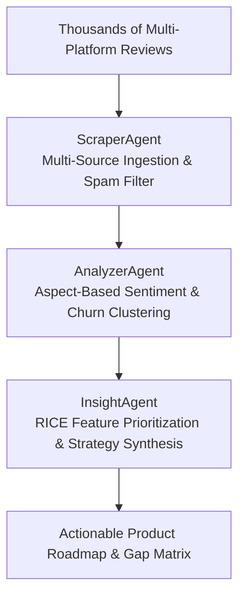

# FeedbackX: Autonomous Customer Feedback Mining & Market Intelligence Specification

## 1. Executive Summary & Problem Formulation

Product teams struggle to manually sift through thousands of fragmented customer reviews across App Stores, G2, Trustpilot, and Reddit. As a result, critical product pain points and high-friction churn drivers remain buried, leading to misguided roadmaps and lost market share.

**FeedbackX** establishes an **autonomous customer feedback intelligence loop**:
1. **ScraperAgent**: Multi-channel ingestion from App Store, Google Play, G2, Trustpilot, and Reddit with automated spam and bot noise eradication.
2. **AnalyzerAgent**: Aspect-Based Sentiment Analysis (ABSA) identifying specific feature friction and quantifying churn risk scores.
3. **InsightAgent**: RICE prioritization scoring and executive product roadmap synthesis.

---

## 2. Loop-Driven Feedback Intelligence Pipeline

